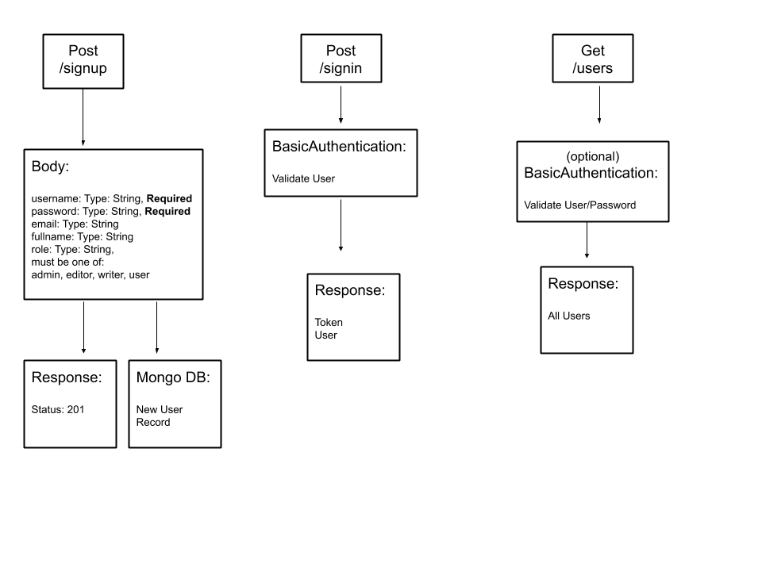

# LAB - Class 11  
## Project: Authentication
### Author: Jennifer Chinzi
### Links and Resources
n/a  
### Setup
* create .env
  - PORT=####
  - MONGODB_URI=mongodb://localhost:27017/DB_NAME
  - SECRET=somesecretstring
* npm install
  - dotenv
  - express
  - mongoose
  - base-64
  - bcrypt
  - jsonwebtoken

### How to initialize/run your application (where applicable)
* npm start
### How to use your library (where applicable)
n/a
### Tests
* npm install jest
* npm install @code-fellows/supergoose
* npm test  
### UML

---

# LAB - Class 12   
## Project: OAuth
### Author: Jennifer Chinzi
### Links and Resources
n/a  
### Setup
* create .env
  - PORT=####
  - MONGODB_URI=mongodb://localhost:27017/DB_NAME
  - SECRET=somesecretstring
  - GITHUB_CLIENT_ID=yourGitHubClientID
  - GITHUB_CLIENT_SECRET=yourGitHubClientSecret
* npm install
  - dotenv
  - express
  - mongoose
  - base-64
  - bcrypt
  - jsonwebtoken
  - superagent

### How to initialize/run your application (where applicable)
* npm start
### How to use your library (where applicable)
n/a
### Tests
* npm install jest
* npm install @code-fellows/supergoose
* npm test  
### UML

---

# LAB - Class 13   
## Project: Bearer Authorization
### Author: Jennifer Chinzi
### Links and Resources
n/a  
### Setup
* create .env
  - PORT=####
  - MONGODB_URI=mongodb://localhost:27017/DB_NAME
  - SECRET=somesecretstring
  - GITHUB_CLIENT_ID=yourGitHubClientID
  - GITHUB_CLIENT_SECRET=yourGitHubClientSecret
* npm install
  - dotenv
  - express
  - mongoose
  - base-64
  - bcrypt
  - jsonwebtoken
  - superagent

### How to initialize/run your application (where applicable)
* npm start
### How to use your library (where applicable)
n/a
### Tests
* npm install jest
* npm install @code-fellows/supergoose
* npm test  
### UML
